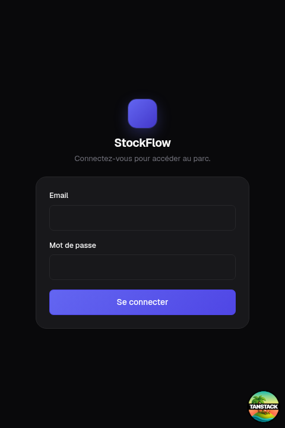
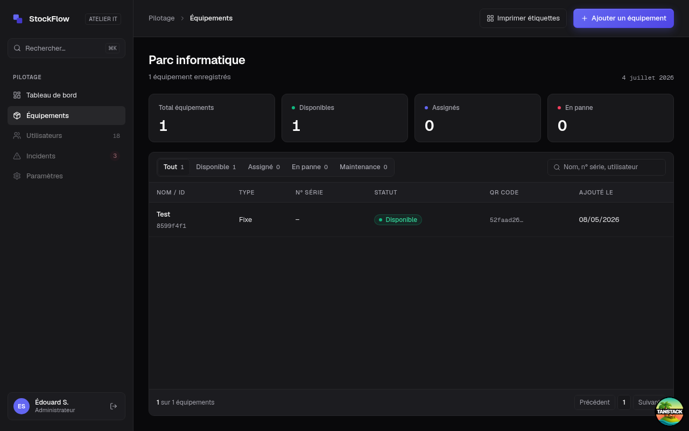
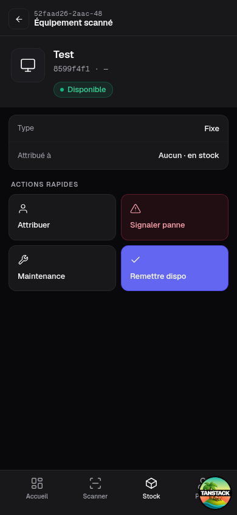
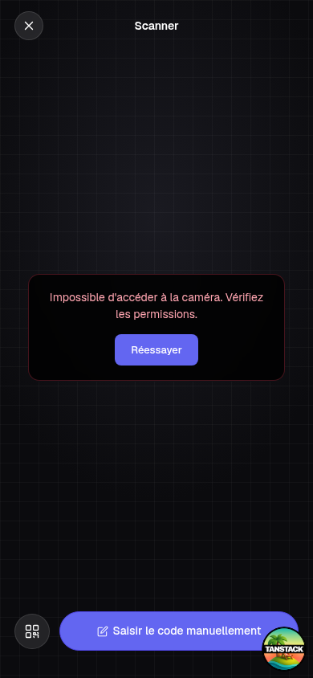
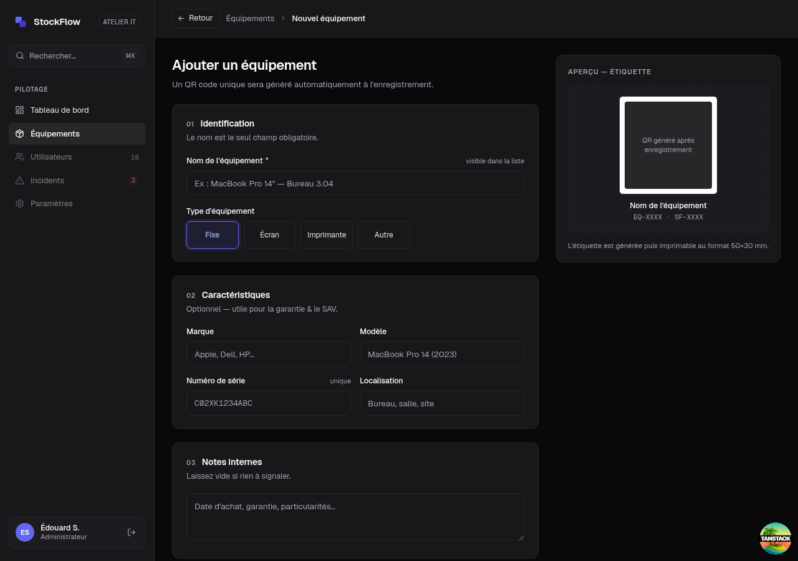

# Sommaire

1. **Introduction** — le projet, le périmètre livré, la méthode de travail
2. **Environnement de développement et intégration continue** — outillage, CI/CD, critères de qualité
3. **Conception** — architecture, modèle de données, framework, langages, paradigmes, référentiel de composants
4. **Réalisations** — parcours livrés, captures, le hors-ligne (PWA)
5. **Sécurisation** — authentification, Row Level Security, revue adversariale, audit OWASP Top 10
6. **Accessibilité (RGAA)** — socle mécanique, audit outillé, violations corrigées
7. **Tests et recette** — harnais, couverture, cahier de recettes
8. **Versions, qualité et correction des bogues**
9. **Manuels et exploitation** — arbitrage d'hébergement, déploiement, mise à jour, utilisation
10. **Conclusion** — acquis, limites écrites, perspectives
11. **Annexes** — correspondance pièces officielles ↔ dossier technique

# Introduction

## Le projet

StockFlow est une application web de gestion de parc informatique destinée aux TPE/PME :
inventaire des équipements (postes, écrans, imprimantes), étiquetage par QR code, scan
mobile sur le terrain, signalement et suivi des incidents — y compris **hors connexion**,
avec une file de synchronisation visible pour le technicien qui intervient dans une cave
ou un local sans réseau.

Le besoin, cadré au Bloc 1 : les petites structures gèrent leur parc dans un tableur (au
mieux), l'inventaire dérive (« inventaire fantôme »), les pannes se signalent oralement et
se perdent. StockFlow vise un time-to-value inférieur à une journée : créer les
équipements, imprimer les QR codes, scanner.

Ce dossier présente la réalisation du Bloc 2 : conception, développement, sécurisation,
tests et livraison de la solution. Chaque affirmation renvoie à une pièce détaillée du
dossier technique (`docs/certification/` dans le dépôt) et, en dernier ressort, au code
et à l'historique git eux-mêmes — le dépôt est la source de vérité.

- **Code source** : <https://github.com/EdouardSence/StockFlow>
- **Application en production** : <https://stock-flow-gamma-eight.vercel.app>

## Périmètre livré

| Parcours | État |
|---|---|
| Authentification (JWT RS256, deux rôles admin/technicien) | Livré |
| Inventaire : liste, recherche, création, fiche, statuts | Livré |
| QR codes : génération à la création, scan mobile caméra + saisie manuelle | Livré |
| Incidents : signalement terrain (mobile), qualification et cycle de vie admin | Livré |
| PWA hors-ligne : installable, consultation offline, incident offline + file de sync | Livré |
| Comptes : self-service mot de passe, gestion des utilisateurs (admin) | Livré |
| Export CSV/PDF, notifications, journal d'audit | Hors périmètre, choix assumé |

Les fonctions non livrées ne sont pas des oublis : elles ont été explicitement écartées
du périmètre en cours de projet et documentées comme telles dans le cahier de recettes —
le projet a privilégié la profondeur (sécurité réelle, offline réel, tests réels) sur
l'étendue.

## Méthode de travail

Le projet a été conduit en sessions thématiques (« lots ») tracées dans `PROGRESS.md` :
chaque lot part d'un objectif, se termine par des tests verts et une documentation à
jour, et alimente un Kanban GitHub (« StockFlow — Suivi qualité & certification », 32
issues à ce jour). Deux disciplines transverses ont structuré le travail :

- **Traçabilité** : tout bug ou dette découvert devient une issue GitHub qualifiée
  (constat, reproduction, cause, impact) *avant* correction, et l'issue est fermée avec
  un résumé du correctif vérifié — jamais silencieusement.
- **Honnêteté documentaire** : les documents disent ce qui est mesuré et ce qui ne l'est
  pas, ce qui est corrigé et ce qui est un risque accepté. Les limites connues (elles
  existent) sont écrites noir sur blanc plutôt que maquillées.

Chronologie des lots (résumé de `PROGRESS.md`) :

| Lot | Date | Contenu | Jalon |
|---|---|---|---|
| Retrofit qualité | 2026-07-02/03 | Schéma corrigé, lint 13→0, CI + hooks, documentation initiale | `v0.2.0` |
| Auth + RLS | 2026-07-03/04 | JWT RS256, RBAC, Row Level Security, revue adversariale + correctifs | `v0.3.0` |
| Alignement design | 2026-07-04 | Thème sombre Geist sur tous les écrans, captures avant/après | |
| Pannes & assignation | 2026-07-05 | Domaine Effect (transitions, assignation), écran incidents, signalement mobile | |
| Harnais + recettes | 2026-07-06 | Suite e2e Playwright, cahier de recettes exécuté, anomalies AN-1/AN-2 corrigées | |
| Sécurité consolidée | 2026-07-06/07 | Validation Zod partout, en-têtes HTTP, masquage d'erreurs, rate limiting, audit OWASP | |
| Comptes | 2026-07-07 | Self-service mot de passe, gestion des utilisateurs admin | |
| Accessibilité | 2026-07-07 | Audit RGAA outillé, 3 violations corrigées, couverture clôturée | |
| PWA offline | 2026-07-12 | Service worker, consultation offline, incident hors-ligne + file de sync | périmètre `v0.4.0` |
| Documentation & CI | 2026-07-12/13 | Manuels, arbitrage hébergement, réparation CI (#26), ce rapport | |

# 1. Environnement de développement et intégration continue

*Pièces détaillées : 03 (environnement), 01 (déploiement continu), 17 (critères qualité).*

## 1.1 Outillage

Le projet tourne sur **Bun** (runtime, gestionnaire de paquets et lanceur de tests en un
seul outil), avec **Biome** pour le lint et le format — un seul binaire là où la paire
ESLint+Prettier en demanderait deux et une réconciliation de configs. Le typage est
vérifié par `tsc --noEmit`, les tests unitaires par **Vitest**, les tests de bout en bout
par **Playwright**. Les hooks git locaux (Husky) bloquent avant même la CI : `pre-commit`
exécute lint et typecheck, `commit-msg` impose le format Conventional Commits
(commitlint) — historique lisible et parsable.

## 1.2 Chaîne d'intégration et de déploiement continus

Chaque push sur `main` et chaque pull request déclenchent la CI GitHub Actions :
lint → typecheck → tests purs → build. Un échec bloque. Le déploiement est continu :
push sur `main` = déploiement production Vercel ; chaque PR obtient un déploiement de
prévisualisation.

Un incident de pipeline mérite d'être raconté ici plutôt que caché : **la CI est restée
rouge neuf jours (3 au 12 juillet) sans que personne ne s'en aperçoive**. Le step de test
mourait au chargement — la garde de sécurité fail-closed du client de base de données
(§ 4.3) exige une variable d'environnement que la CI n'avait pas, alors qu'en local elle
est chargée depuis `.env.local`. L'incident a été qualifié (issue #26), corrigé sans
affaiblir la garde (URL factice + exclusion en CI des tests d'intégration qui exigent la
base réelle), et une mesure anti-récidive a été prise : un badge de statut CI dans le
README rend le rouge visible. C'est exactement le cycle de correction décrit au § 7.3.

## 1.3 Critères de qualité

Huit KPI produit ont été fixés au cadrage (time-to-value, inventaire fantôme, parc
scannable, temps de chargement, couverture de tests, SUS, vulnérabilités OWASP, coût
d'hébergement). La pièce 17 tient la comptabilité honnête : ce qui est mesuré l'est avec
sa valeur (couverture § 6.2, vulnérabilités § 4), ce qui exigerait un déploiement client
réel ou un panel d'utilisateurs est marqué « non mesuré » plutôt que rempli d'un chiffre
inventé. Les *gates* réellement bloquants aujourd'hui sont la CI et les hooks locaux.

# 2. Conception

*Pièces détaillées : 18 (architecture), 06 (modèle de données), 04/05/19
(framework, langages, paradigmes), 07 (référentiel de composants).*

## 2.1 Architecture

```
Client (navigateur / PWA)         React 19, TanStack Router, Tailwind 4
        │  SSR + RPC typé de bout en bout
        ▼
Server functions TanStack Start   Vite + Nitro, runtime Bun
        │  authMiddleware / adminMiddleware sur chaque fonction
        ▼  Kysely — SQL exclusivement paramétré
PostgreSQL (Supabase)             RLS (13 policies), rôle stockflow_app
```

Trois décisions structurent tout le reste :

1. **Les server functions sont l'unique frontière vers les données.** Chaque fonction
   serveur porte explicitement un middleware d'authentification (`authMiddleware` ou
   `adminMiddleware`). La garde de navigation côté client (`beforeLoad`) n'est que du
   confort UX — la barrière de sécurité est serveur, toujours.
2. **Le code métier pur est séparé de la présentation.** La logique critique (cycle de
   vie des incidents, règles d'assignation, primitives d'authentification, file offline)
   vit dans `src/lib/*.ts`, sans dépendance au framework — c'est ce qui rend le critère
   de couverture « ≥ 80 % sur la logique métier » atteignable et honnête (§ 6.2).
3. **L'accès aux données passe exclusivement par Kysely** (query builder typé), jamais
   par du SQL concaténé. Le choix d'un query builder plutôt qu'un ORM est délibéré : la
   Row Level Security dépend de paramètres de session posés par transaction (§ 4.3), un
   ORM masquerait précisément ce détail critique.

Le découpage du code est *feature-based* par route (`src/routes/equipment/*`,
`scan.tsx`, `incidents.tsx`, `admin/users.tsx`), avec les composants réutilisés dans
`src/components/` et l'accès données centralisé dans `src/db/`.

## 2.2 Modèle de données

Quatre tables PostgreSQL : `users` (deux rôles, contrainte CHECK), `equipment` (type et
statut contraints par CHECK en base — pas seulement par le type TypeScript, les deux
évoluent dans le même commit), `incidents` (FK vers équipement et rapporteur, cycle
`open → in_progress → resolved`), `refresh_tokens` (rotation de session, § 4.2).

```
users                                    equipment
  id            text PK                    id            text PK
  name          text NOT NULL              name          text NOT NULL
  email         text NOT NULL UNIQUE       type          CHECK (pc|screen|printer|other)
  role          CHECK (admin|technician)   brand, model, notes        text
  password_hash text (nullable =           serial_number text UNIQUE
                 compte non activable)     qr_code       text NOT NULL UNIQUE
  created_at    timestamptz                status        CHECK (available|assigned|
                                                          broken|maintenance)
incidents                                  assigned_to   FK → users ON DELETE SET NULL
  id            text PK                    created_at, updated_at     timestamptz
  equipment_id  FK → equipment CASCADE
  reported_by   FK → users               refresh_tokens
  description   text                       id            text PK
  status        CHECK (open|               user_id       FK → users CASCADE
                 in_progress|resolved)     token_hash    text NOT NULL UNIQUE
  created_at    timestamptz                expires_at    timestamptz NOT NULL
  resolved_at   timestamptz                revoked_at    timestamptz
```

Les six migrations racontent l'évolution : création (001), resserrage de l'énumération
des types avec remap des données (002), authentification (003), Row Level Security —
13 policies, rôle applicatif, grants par colonne (004), self-service mot de passe (005),
gestion des comptes admin avec une fonction qui expose le statut d'activation *sans
jamais exposer le hash* (006).

Le schéma vit dans des migrations SQL versionnées (`src/db/migrations/001` à `006`),
appliquées dans l'ordre alphabétique et **idempotentes par convention** : le script les
rejoue intégralement, une migration déjà appliquée ne casse rien, et une erreur se
corrige *en avant* (nouveau fichier), jamais en réécrivant un fichier déjà appliqué en
production.

## 2.3 Framework, langages, paradigmes

**TanStack Start** (React 19, SSR, routes fichier) a été préféré à Next.js pour ses
server functions typées de bout en bout : le contrat client-serveur est un type
TypeScript, pas une couche d'API à maintenir. **TypeScript strict** couvre tout le code
applicatif, les types de données étant *dérivés* du schéma (pas dupliqués à la main) ;
le **SQL** reste le langage du schéma et de la sécurité ligne-à-ligne ; le **CSS** passe
par Tailwind 4 et des design tokens (`--sf-*`) audités pour le contraste (§ 5).

Le noyau fonctionnel le plus critique — transitions d'état des incidents, règles
d'assignation — est écrit avec **Effect** : fonctions pures, erreurs discriminées et
typées, testées exhaustivement (les 9 combinaisons de transitions, pas seulement les cas
heureux). Effect avait été retenu au cadrage pour ce type de logique ; il a été
délibérément *réservé* à ce domaine plutôt qu'étalé cosmétiquement sur du code simple.

## 2.4 Référentiel de composants

La pièce 07 inventorie les deux référentiels : composants d'interface internes
(navigation, badges de statut, bandeau de synchronisation offline) et dépendances de
production avec leur politique de suivi — versions verrouillées par `bun.lock`,
`bun audit` à chaque montée, et une règle appliquée jusqu'au bout : **pas de nouvelle
dépendance sans justification**. La fonctionnalité offline entière a été livrée avec
zéro ajout (IndexedDB natif plutôt qu'une librairie de file).

# 3. Réalisations

*Pièces détaillées : 02 (prototype), 21 (manuel d'utilisation), 18 § hors-ligne.*

## 3.1 Les parcours livrés

Le technicien vit dans l'interface mobile : accueil, scan d'un QR code (caméra, ou
saisie manuelle si l'étiquette est abîmée), fiche équipement, tuile « Signaler panne ».
L'administrateur vit dans l'interface desktop : tableau de bord (KPI du parc, incidents
ouverts), inventaire complet avec recherche, création d'équipement (QR généré
automatiquement), écran incidents avec le cycle de qualification, gestion des comptes.

| Capacité | Technicien | Administrateur |
|---|---|---|
| Consulter le parc, scanner, voir une fiche | ✅ | ✅ |
| Changer le statut d'un équipement | ✅ | ✅ |
| Signaler une panne (y compris hors-ligne) | ✅ | ✅ |
| S'assigner / se désassigner un équipement | ✅ (lui-même uniquement) | ✅ (n'importe qui) |
| Créer / modifier un équipement | — | ✅ |
| Qualifier et faire avancer les incidents | — | ✅ |
| Créer / désactiver des comptes | — | ✅ |
| Changer son propre mot de passe | ✅ | ✅ |

Cette matrice n'est pas seulement une affaire d'interface : chaque ligne est portée par
un middleware serveur et, en dessous, par les policies RLS — un technicien qui rejouerait
l'appel réseau d'une action admin est refusé deux fois (§ 4).

Un choix métier assumé : **signaler une panne ne change pas le statut de l'équipement**.
C'est l'administrateur qui qualifie l'incident depuis son écran — le signalement terrain
est une remontée d'information, pas une action d'administration.

### Captures (thème sombre Geist, design de référence du cadrage)

| | |
|---|---|
|  |  |
| Connexion | Inventaire (desktop) |
|  |  |
| Fiche équipement (mobile) | Scanner QR (mobile) |



*Création d'équipement : sélecteur de type en boutons radio natifs (accessibilité, § 5),
QR code généré à la création.*

## 3.2 Le hors-ligne (PWA), le vrai risque technique du projet

Le cadrage identifiait le mode hors-ligne comme le point le plus risqué. Il a été livré
en dernier lot de développement, sur un périmètre volontairement précis : **tout ce qui
a été visité se consulte hors-ligne ; une seule écriture — la création d'incident — est
possible hors-ligne**, parce que c'est le cas terrain réel (le technicien devant la
machine en panne, sans réseau).

L'architecture sépare deux briques :

- **Le cache** est l'affaire du service worker (Workbox, généré par `vite-plugin-pwa`) :
  stratégie *NetworkFirst* sur les navigations et les lectures serveur (jamais sur les
  écritures), *CacheFirst* sur les assets immuables. Aucun code applicatif dedans.
- **La file de synchronisation** est du code applicatif ordinaire : quand la création
  d'incident échoue en erreur réseau, l'incident part dans une file IndexedDB ; un
  bandeau global affiche « N incident(s) en attente de synchronisation » ; le flush se
  déclenche automatiquement au retour du réseau (et par bouton manuel), s'arrête au
  premier échec, ne perd rien et ne duplique rien. Cette logique est pure et testée
  unitairement ; le parcours complet (hors-ligne → file → retour réseau → ligne en base)
  est couvert par un scénario de bout en bout.

L'alternative « canonique » (file dans le service worker via Background Sync API) a été
évaluée et rejetée : API limitée à Chromium, file invisible depuis l'interface,
intestable unitairement. Le rejet est documenté — savoir écarter une solution à la mode
fait partie de la conception.

La session a aussi traité un cas rarement anticipé : **que devient la garde
d'authentification quand le serveur est injoignable ?** Réponse implémentée : sur échec
de *transport* (et uniquement là), l'interface retombe sur la dernière identité connue,
mise en cache sans aucun champ sensible, purgée à la déconnexion. Aucun droit n'en
découle : les données affichées viennent du cache déjà autorisé, et toute écriture
repasse par le serveur au moment de la synchronisation — une session expirée y est
refusée et la file reste intacte.

# 4. Sécurisation

*Pièce détaillée : 09 (la plus fournie du dossier) ; voir aussi 14 (plan de correction).*

## 4.1 Posture

La sécurité de StockFlow ne repose pas sur une liste de cases cochées mais sur trois
couches et une discipline : middleware d'authentification sur chaque fonction serveur,
Row Level Security en défense en profondeur dans PostgreSQL, validation systématique des
entrées — et une **revue adversariale** qui a attaqué le tout avant qu'un client ne le
fasse.

## 4.2 Authentification et sessions

JWT **RS256** maison : jeton d'accès de 15 minutes + jeton de rafraîchissement **rotatif**
en cookies httpOnly (jamais accessibles au JavaScript). Les mots de passe sont hachés en
**argon2id**. Le login est protégé par un **rate limiting à trois niveaux** (par couple
IP+email, par email seul, par IP) contre le bruteforce distribué et le credential
stuffing. Les messages d'erreur sont anti-énumération : « Email ou mot de passe
incorrect », y compris pour un compte désactivé.

Cycle de vie d'une session :

1. **Login** : vérification argon2id (via la fonction `SECURITY DEFINER`, § 4.3) →
   émission d'un access token (15 min) et d'un refresh token (7 jours), les deux en
   cookies httpOnly + Secure + SameSite=Strict.
2. **Rafraîchissement** : le refresh token est à usage unique — chaque utilisation le
   révoque et en émet un nouveau (*rotation*), par une écriture conditionnelle atomique
   (deux requêtes concurrentes ne peuvent pas toutes deux réussir).
3. **Détection de vol** : si un refresh token déjà consommé est rejoué hors de la courte
   fenêtre de grâce (requêtes légitimes simultanées), toute la *famille* de tokens de la
   session est révoquée — le voleur et la victime sont déconnectés, l'anomalie est
   visible.
4. **Logout** : révocation immédiate, hors fenêtre de grâce (correctif de la revue de
   sécurité, § 4.4) ; l'identité offline mise en cache est purgée (§ 3.2).

## 4.3 Row Level Security — défense en profondeur, et ses limites dites honnêtement

Le runtime se connecte avec un rôle PostgreSQL dédié (`stockflow_app`), sans privilège
de contournement. L'identité vérifiée du JWT est posée *par transaction* dans des
paramètres de session que lisent les policies RLS. Le wrapper est **fail-closed** : toute
requête hors de ce contexte n'a aucun claim, donc PostgreSQL refuse tout. Même
philosophie à l'initialisation : sans la variable du rôle applicatif, l'application
*refuse de démarrer* plutôt que de retomber silencieusement sur un rôle qui
désactiverait la RLS. Le hachage des mots de passe est illisible même pour le rôle
applicatif (droits par colonne) ; le login passe par une fonction `SECURITY DEFINER` qui
n'expose que le strict nécessaire.

La limite est documentée plutôt que niée : les claims étant auto-déclarés par la
connexion applicative, la RLS protège contre l'oubli de contexte, les bugs de requête et
l'accès direct par l'API publique — mais pas contre une compromission totale de la
connexion serveur, qui permettrait de forger les claims. Devant le jury comme dans la
pièce 09, la RLS est défendue pour ce qu'elle est : une défense en profondeur robuste,
pas une garantie absolue.

## 4.4 La revue adversariale et l'audit OWASP

Le lot auth+RLS a été soumis à une revue de sécurité multi-agents en mode adversarial :
chaque finding devait être *vérifié* (scénario d'attaque concret) ou *réfuté* par un
examinateur indépendant. Quatorze findings ont été vérifiés ; les défauts confirmés ont
été corrigés en commits `fix:` distincts et datés — **sans réécrire l'historique git**
(pièce 08) : la preuve que le processus de revue fonctionne vaut plus que l'illusion
d'un code parfait au premier jet. Les findings restants sont soit réfutés avec
argumentaire, soit acceptés comme risques mineurs documentés (issues #4 à #7 :
non-revérification en base du JWT pendant ses 15 minutes de vie, absence de logout
global multi-session — chacun avec sa justification).

Extrait des corrections issues de la revue (tableau complet dans la pièce 09) :

| Défaut confirmé | Sévérité | Correctif |
|---|---|---|
| Fail-open RLS : repli silencieux sur le rôle `postgres` (BYPASSRLS) si la variable applicative manquait | medium | Refus de démarrer (fail-closed) |
| Fenêtre de grâce de rotation exploitable après un logout : un cookie volé rejoué sous 10 s obtenait un access token | medium | Logout révoque hors grâce ; replay = vol → révocation de famille |
| Rotation du refresh token non atomique (deux requêtes concurrentes pouvaient toutes deux réussir) | medium | UPDATE conditionnel (compare-and-set) |
| Rate limiter à clé email seule : verrouillage du compte d'autrui à distance (DoS) | medium | Clé composée IP+email |
| Sentry envoyait IP et données personnelles par défaut | low | `sendDefaultPii: false` |

Un audit **OWASP Top 10 (2021)** formalisé complète la revue : chaque catégorie jugée
contre le code réellement livré, avec preuves et résiduels.

| Catégorie | Statut | En bref |
|---|---|---|
| A01 Broken Access Control | ✅ | Middleware sur chaque fonction serveur + 13 policies RLS fail-closed, prouvés par tests d'intégration et e2e |
| A02 Cryptographic Failures | ✅ | argon2id, RS256 verrouillé, refresh tokens hachés, cookies httpOnly+Secure+SameSite=Strict, HSTS |
| A03 Injection | ✅ | SQL exclusivement paramétré (Kysely), zéro `dangerouslySetInnerHTML`, CSP, Zod sur toutes les entrées |
| A04 Insecure Design | ✅ | Domaine pur testé exhaustivement, fail-closed par défaut, revue adversariale, alternatives documentées |
| A05 Security Misconfiguration | 🟡 | En-têtes durcis et vérifiés en prod ; résiduel : `unsafe-inline` imposé par l'hydratation du framework |
| A06 Vulnerable Components | 🟡 | Lockfile épinglé ; 16 vulnérabilités transitives **dev-only** tracées (#24), aucune n'atteint le runtime |
| A07 Auth Failures | 🟡 | Rate limiting 3 étages, anti-énumération, détection de réutilisation ; résiduels bornés #4/#5 |
| A08 Software & Data Integrity | 🟡 | Chaîne de build maîtrisée, aucun script distant ; résiduel générique : confiance npm |
| A09 Logging & Monitoring | 🟡 | Sentry (sans PII), logs serveur, échecs de login comptés ; pas de journal d'audit applicatif (hors périmètre) |
| A10 SSRF | ⚪ | Aucune requête sortante construite depuis une entrée utilisateur |

Aucune catégorie rouge ; chaque 🟡 a un résiduel identifié, tracé en issue et défendable.
Les erreurs PostgreSQL brutes sont masquées au client (elles exposeraient noms de tables
et contraintes) et journalisées côté serveur.

# 5. Accessibilité (RGAA)

*Pièce détaillée : 10.*

L'accessibilité est un critère éliminatoire de la certification — et un domaine où il
est facile de se contenter du lint. Le projet a fait les deux : un **socle mécanique**
(règles Biome `lint/a11y/*` bloquantes en CI : icônes décoratives masquées aux lecteurs
d'écran, boutons icône nommés, groupes de champs en `fieldset`/`legend`) puis un **audit
outillé en conditions réelles** (juillet 2026) : arbre d'accessibilité Chromium — celui
que consulte réellement un lecteur d'écran — sur neuf écrans, navigation clavier
scriptée, calcul de contraste WCAG sur les 18 paires du système de design.

Écrans audités : connexion, tableau de bord, liste et fiche équipement (desktop et
mobile), création d'équipement, scanner, incidents, compte, gestion des utilisateurs.

L'audit a trouvé trois violations réelles, toutes corrigées et re-vérifiées :

1. **Focus clavier invisible** : des `outline: none` posés en style inline sur les champs
   de cinq écrans écrasaient l'indicateur global de focus. Issue #25, suppression des
   styles fautifs, vérification avant/après au clavier.
2. **Contraste insuffisant du texte secondaire** (3,67:1, sous le seuil AA de 4,5:1) sur
   onze emplacements : le token de couleur a été ajusté (4,78:1), en conservant la
   cohérence du système de design.
3. **En-tête de tableau vide** (colonne actions de la gestion des comptes) : libellé
   masqué visuellement ajouté.

L'audit a aussi tranché une question ouverte : le sélecteur de type d'équipement,
initialement des boutons stylisés, est devenu un **vrai groupe de boutons radio natifs**
(issue #11) — la sémantique native plutôt que l'ARIA reconstruit. Limitation assumée et
écrite : pas de test avec un lecteur d'écran audio réel (NVDA/VoiceOver), hors de portée
de l'environnement de développement.

# 6. Tests et recette

*Pièces détaillées : 11 (harnais), 12 (couverture), 13 (cahier de recettes).*

## 6.1 Le harnais

**99 tests Vitest** couvrent la logique pure : primitives d'authentification (signature
et vérification JWT, expiration, verrouillage d'algorithme, argon2id, rotation des
refresh tokens, rate limiting), les 9 combinaisons de transitions du cycle de vie
incident, les règles d'assignation, tous les schémas de validation d'entrée avec leurs
cas limites, et la file offline. S'y ajoutent **15 tests d'intégration RLS** exécutés
contre la vraie base : ils simulent un contournement du wrapper applicatif et prouvent
que PostgreSQL refuse (fail-closed vérifié, pas supposé).

**36 scénarios Playwright** couvrent les parcours complets contre le serveur réel et la
vraie base : authentification, RBAC (un technicien qui force l'URL d'un écran admin est
rejeté), CRUD équipement, scan (y compris la saisie manuelle et le code inconnu),
incidents (la tuile mobile crée une vraie ligne en base, vérifiée en SQL), assignation,
comptes, navigation mobile, et le scénario offline complet. La base étant partagée avec la production
(dette documentée), la suite e2e ne tourne **jamais en CI** : exécution locale
supervisée, données confinées par un préfixe strict et un nettoyage systématique avant
et après.

## 6.2 La couverture, mesurée et interprétée honnêtement

Le critère du cadrage : ≥ 80 % sur la logique métier **pure**. Résultat : les domaines
Effect (incidents, assignation) sont à **100 %**, les primitives de sécurité à **92 %**,
tous les schémas de validation à 100 % comportemental (chaque règle testée par un cas
qui passe et un cas qui échoue). Au sens du critère d'évaluation — « les tests unitaires
couvrent la majorité du code développé » — la logique développée spécifiquement pour le
projet (`src/lib` : domaine métier, primitives d'authentification, validation, file
offline) est couverte très majoritairement à l'unitaire ; le reste du code développé
(server functions, routes) est couvert par les tests d'intégration RLS et les 36
scénarios de bout en bout, qui exécutent le vrai code contre la vraie base. Le
pourcentage *global* du dépôt (~45 % de statements) est plus bas — et la pièce 12 explique pourquoi c'est un artefact de mesure et non un
trou : les coquilles d'entrée/sortie (server functions, client de base de données) sont
délibérément couvertes par les tests d'intégration et de bout en bout, pas par des tests
unitaires qui ne feraient que mocker ce qu'ils prétendent tester. La pièce documente
aussi un piège d'outillage identifié en route : la couverture v8 marque les schémas Zod
« couverts » dès leur construction au chargement du module — seuls des tests
comportementaux (`parse()` sur des cas limites) vérifient réellement la validation, et
c'est ce que fait le harnais.

Couverture par domaine (remesure du 2026-07-14, pièce 12) :

| Périmètre | Statements | Lecture |
|---|---|---|
| `incidents-domain.ts` / `equipment-domain.ts` (Effect) | 100 % | Matrice de transitions et règles d'assignation exhaustives |
| `auth-core.ts` (JWT, argon2id, refresh, rate limiting) | 92 % | Primitives de sécurité |
| Schémas Zod (equipment, incidents, auth, users) | 100 % comportemental | Chaque règle testée en positif et en négatif |
| Coquilles I/O (server functions, client DB) | 23-37 % unitaire | Couvertes par les 15 tests d'intégration RLS et la suite e2e |
| **Global dépôt** | ~45 % | Artefact de périmètre, expliqué et assumé |

## 6.3 Le cahier de recettes

Chaque scénario du cahier (pièce 13) correspond à un test Playwright réel — aucun
scénario « sur le papier ». Dernière exécution : **36/36 verts en 66 secondes**. Les
assertions ne s'arrêtent pas à l'interface : les scénarios marqués `[DB]` vérifient la
ligne PostgreSQL réellement écrite (statut, rapporteur, intégrité). La rédaction du
cahier a elle-même servi de filet : c'est en écrivant le scénario de saisie manuelle
qu'une anomalie réelle a été découverte (bouton décoratif sans action, AN-1/issue #22),
qualifiée, corrigée — et que la correction a révélé une seconde anomalie (crash au
démontage de l'écran de scan, #23), corrigée dans la foulée.

| Famille de scénarios | Fichier | Nb | Exemples d'assertions |
|---|---|---|---|
| Authentification | `auth.spec.ts` | 4 | Login/logout, identifiants invalides, session persistante |
| RBAC | `rbac.spec.ts` | 3 | Technicien forçant une URL admin → rejeté, y compris au niveau server function |
| CRUD équipement | `equipment.spec.ts` | 4 | Création → ligne en base, recherche, statuts |
| Scan QR (mobile) | `scan.spec.ts` | 4 | Navigation par code, saisie manuelle, code inconnu → erreur propre |
| Tableau de bord | `dashboard.spec.ts` | 3 | KPI cohérents avec la base |
| Incidents | `incidents.spec.ts` | 3 | Signalement mobile → ligne `open` en base `[DB]`, cycle admin complet |
| Assignation | `assignment.spec.ts` | 3 | Admin assigne quiconque, technicien seulement lui-même |
| Compte | `account.spec.ts` | 3 | Changement de mot de passe, mauvais mot de passe actuel |
| Comptes admin | `admin-users.spec.ts` | 4 | Création + login du compte créé, email dupliqué, désactivation, accès technicien rejeté |
| Hors-ligne | `offline.spec.ts` | 1 | Incident offline → file → retour réseau → ligne en base `[DB]` |
| Navigation mobile & sidebar | `mobile-nav.spec.ts` | 4 | Liste mobile en cartes, onglet Profil → /account, identité réelle et nav filtrée par rôle dans la sidebar |
| **Total** | | **36** | 36/36 verts, 66 s |

# 7. Versions, qualité et correction des bogues

*Pièces détaillées : 08 (historique), 20 (dernière version stable), 14 (plan de
correction).*

## 7.1 Historique des versions

Conventional Commits imposés par hook (type en anglais, description en français),
tags annotés aux jalons :

| Version | Date | Contenu |
|---|---|---|
| `v0.2.0` | 2026-07-03 | Base fonctionnelle : CRUD équipements, scan, QR — sans auth ni RLS |
| `v0.3.0` | 2026-07-04 | Authentification JWT RS256 + RBAC + Row Level Security |
| `v0.4.0` | 2026-07-13 | Incidents, sécurité consolidée, accessibilité auditée, PWA offline |

L'épisode le plus significatif de cet historique est un
*non-événement volontaire* : après la revue de sécurité, les correctifs ont été commités
en `fix:` visibles plutôt que fondus dans l'historique par rebase — la traçabilité du
processus vaut plus que l'esthétique de l'historique.

## 7.2 Dernière version fonctionnelle, fiable, viable

La pièce 20 est un document vivant qui décrit, à chaque instant, ce que contient la
dernière version stable : fonctionnalités opérationnelles, suites de tests vertes
(99 unitaires + 36 e2e), dettes connues au moment du snapshot. C'est la pièce qui
empêche le dossier de dériver du code.

## 7.3 Plan de correction des bogues

Le cycle est outillé de bout en bout : détection (revue adversariale, audits,
utilisation réelle, rédaction des recettes) → qualification en issue GitHub (constat,
reproduction, cause, impact, plan) → correction → fermeture avec résumé vérifié →
suivi Kanban. Trente-deux issues à ce jour, toutes qualifiées. Deux exemples complets du
cycle sont documentés : la dette lint initiale (#3, 13 erreurs) et l'incident CI de
juillet (#26, § 1.2) — ce dernier illustrant aussi la boucle d'amélioration : chaque
incident produit une mesure anti-récidive, pas seulement un correctif.

# 8. Manuels et exploitation

*Pièces détaillées : 15 (déploiement), 16 (mise à jour), 21 (utilisation).*

## 8.1 Arbitrage d'hébergement — un écart de cadrage assumé

Le cadrage envisageait Scalingo (PaaS français, green). La production tourne sur
**Vercel + Supabase** depuis mai 2026, et la décision de juillet est d'y rester :
l'infrastructure est éprouvée et vérifiée (variables, RLS sur le pooler, en-têtes de
sécurité, build PWA), et une migration tardive cumulerait réécriture du pipeline,
migration des données et re-validation complète — pour zéro valeur fonctionnelle. Le
manuel de déploiement documente l'arbitrage *et* une annexe de portabilité qui liste
précisément ce qui changerait pour aller sur Scalingo : rien dans le code applicatif ne
verrouille l'hébergeur. Assumer un écart argumenté plutôt que tenir une promesse au prix
du risque : c'est une décision de pilotage, et elle est écrite.

## 8.2 Les trois manuels

Le **manuel de déploiement** couvre le déploiement depuis zéro (base, migrations
idempotentes, rôle applicatif, variables — avec l'explication de la garde fail-closed),
les vérifications post-déploiement scriptées et le rollback instantané. Le **manuel de
mise à jour** couvre le cycle applicatif (hooks → CI → preview → production), les règles
de migration de schéma, la politique de dépendances, les spécificités du service worker
(mise à jour automatique côté clients, survie de la file offline aux déploiements) et la
rotation des clés JWT. Le **manuel d'utilisation** déroule les parcours des deux rôles,
écran par écran, mode hors-ligne et messages d'erreur compris.

Trois variables d'environnement suffisent à l'exploitation — et leur séparation est une
décision de sécurité :

| Variable | Rôle PostgreSQL | Usage |
|---|---|---|
| `APP_POSTGRES_URL` | `stockflow_app` (soumis à RLS) | Runtime applicatif — obligatoire, l'app refuse de démarrer sans elle |
| `POSTGRES_URL` | `postgres` (propriétaire) | Migrations et seeds uniquement, jamais le runtime |
| `JWT_PRIVATE_KEY` / `JWT_PUBLIC_KEY` | — | Paire RS256 (base64), génération documentée dans `.env.example` |

# Conclusion

## Ce que le projet démontre

Sur la compétence : une application complète, en production, avec une architecture en
couches nette (frontière serveur unique, domaine pur isolé, données sous RLS), une
sécurité construite *et* attaquée, une accessibilité auditée en conditions réelles, un
harnais de tests qui prouve au lieu d'affirmer, et le point techniquement le plus risqué
du cadrage — le hors-ligne — livré avec une conception argumentée.

Sur la méthode : un historique git qui raconte la vérité, 26 issues qualifiées, des
documents vivants qui suivent le code, et des écarts de cadrage tranchés et écrits
plutôt que subis.

## Ce qui reste ouvert, et pourquoi c'est écrit

| Limite | Nature | Où c'est écrit |
|---|---|---|
| Access token non révocable pendant 15 min (#4) | Risque accepté, borné | Pièce 09, § findings acceptés |
| Pas de logout global multi-session (#5) | Fonction manquante, atténuée par la détection de vol | Pièce 09 |
| RLS sans effet si la connexion serveur est totalement compromise (#7) | Limite d'architecture, défendue pour ce qu'elle est | Pièces 09 et 14 |
| 16 vulnérabilités transitives dev-only (#24) | Dette d'outillage, différée par choix | Pièces 07 et 09 (A06) |
| Base partagée dev/production | Dette la plus sérieuse ; confinement strict (préfixe + sweep), cible : base de test séparée | Pièce 13 |
| KPI produit (SUS, time-to-value, 3G) non mesurés | Exigent un déploiement client réel | Pièce 17 |

Un dossier qui prétendrait n'avoir aucune limite décrirait un projet qui n'existe pas.

## Perspectives

Base de test séparée (branche Supabase), seuil de couverture en gate CI, test avec
lecteur d'écran réel, mesure de performance (Lighthouse, 3G) — puis les fonctions
écartées du périmètre (exports, notifications, journal d'audit), dans cet ordre :
d'abord consolider ce qui garantit, ensuite étendre ce qui sert.

# Annexe — Correspondance pièces officielles ↔ dossier technique

| Pièce officielle | Fichier (`docs/certification/`) | Section |
|---|---|---|
| Déploiement continu | `01-deploiement-continu.md` | § 1.2 |
| Intégration continue | `01-deploiement-continu.md` (fusionné) | § 1.2 |
| Critères qualité / performance | `17-criteres-qualite-performance.md` | § 1.3 |
| Architecture logicielle | `18-architecture.md` | § 2.1 |
| Prototype | `02-prototype-logiciel.md` | § 3 |
| Frameworks / paradigmes | `19-frameworks-paradigmes.md`, `04-framework.md`, `05-langages.md` | § 2.3 |
| Référentiel de composants | `07-referentiel-composants.md` | § 2.4 |
| Modèle de données | `06-modele-de-donnees.md` | § 2.2 |
| Tests unitaires / harnais | `11-harnais-de-tests.md` | § 6.1 |
| Couverture de code | `12-couverture-de-code.md` | § 6.2 |
| Sécurité (OWASP) | `09-securisation.md` | § 4 |
| Accessibilité (RGAA) | `10-accessibilite.md` | § 5 |
| Historique des versions | `08-historique-versions.md` | § 7.1 |
| Dernière version stable | `20-derniere-version-stable.md` | § 7.2 |
| Cahier de recettes | `13-cahier-de-recettes.md` | § 6.3 |
| Plan de correction des bogues | `14-plan-correction-bogues.md` | § 7.3 |
| Manuel de déploiement | `15-manuel-deploiement.md` | § 8 |
| Manuel d'utilisation | `21-manuel-utilisation.md` | § 8.2 |
| Manuel de mise à jour | `16-manuel-mise-a-jour.md` | § 8.2 |

# Annexe — Glossaire

| Terme | Définition dans le contexte de StockFlow |
|---|---|
| **Server function** | Fonction TanStack Start exécutée côté serveur, appelée depuis le client comme une fonction TypeScript typée — l'unique frontière vers les données |
| **RLS (Row Level Security)** | Filtrage ligne à ligne appliqué par PostgreSQL lui-même, selon des policies lisant l'identité posée par transaction |
| **Fail-closed** | Comportement par défaut en cas de contexte manquant : tout refuser (plutôt que tout autoriser silencieusement) |
| **JWT RS256** | Jeton signé en RSA asymétrique : le serveur signe avec la clé privée, la vérification n'exige que la clé publique |
| **Rotation de refresh token** | Chaque rafraîchissement de session consomme le jeton et en émet un nouveau ; un jeton rejoué trahit un vol |
| **argon2id** | Fonction de hachage de mots de passe résistante aux attaques par GPU (recommandation OWASP) |
| **Service worker** | Script navigateur interceptant les requêtes réseau, permettant cache et fonctionnement hors-ligne |
| **NetworkFirst / CacheFirst** | Stratégies de cache : essayer le réseau puis retomber sur le cache (données), ou l'inverse (assets immuables) |
| **IndexedDB** | Base de données native du navigateur, utilisée pour la file d'incidents hors-ligne |
| **Effect** | Bibliothèque TypeScript de programmation fonctionnelle : erreurs typées et discriminées, fonctions pures testables sans mock |
| **RGAA** | Référentiel général d'amélioration de l'accessibilité (critères AA du WCAG) |
| **Conventional Commits** | Convention de messages de commit parsable (`type(scope): description`), imposée ici par hook |
